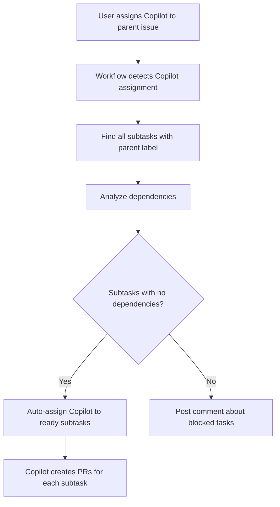
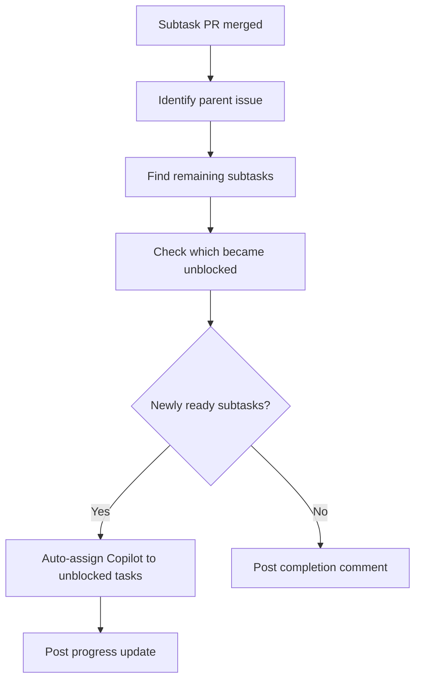

# Copilot Subtask Manager

Automatically manages GitHub Copilot assignments for parallel subtask work.

## Overview

The Copilot Subtask Manager is a GitHub Actions workflow that enables intelligent, automated subtask
management when working with GitHub Copilot on complex issues. It automatically:

1. **Assigns Copilot to ready subtasks** when assigned to a parent issue
2. **Tracks dependencies** between subtasks
3. **Assigns next tasks** automatically when subtasks complete
4. **Enables parallel work** on independent subtasks

## How It Works

### Workflow 1: Parent Assignment → Auto-assign Ready Subtasks

**Trigger:** When Copilot is assigned to an issue



### Workflow 2: Subtask Completion → Assign Next Tasks

**Trigger:** When a subtask PR is merged



## Setup

### Prerequisites

- GitHub repository with Issues enabled
- GitHub Copilot access
- Workflow permissions configured

### Installation

1. The workflow file is already in `.github/workflows/copilot-subtask-manager.yml`
2. No additional configuration needed - it's automatically active

### Permissions Required

```yaml
permissions:
  issues: write          # To assign issues and add comments
  pull-requests: read    # To detect PR completions
  contents: read         # To read repository data
```

## Usage

### Creating a Parent Issue with Subtasks

1. **Create the parent issue** describing the overall feature/task

2. **Create subtasks** as separate issues with:
   - Label: `parent:{parent_issue_number}`
   - Example: If parent is #100, subtasks get label `parent:100`

3. **Define dependencies** (optional) in subtask description:
   - "Depends on #123"
   - "Requires #124, #125"
   - Or use labels: `depends-on:#123`

4. **Assign Copilot to the parent issue**
   - Workflow automatically assigns Copilot to all ready subtasks

### Example

```markdown
# Parent Issue #100: Add User Authentication

This issue tracks implementation of user authentication system.

Subtasks:
- #101: Create database schema
- #102: Implement backend API (depends on #101)
- #103: Create frontend UI
- #104: Add tests (depends on #102, #103)
```

**Creating Subtask Issues:**

**Issue #101:**

```markdown
Title: Create database schema for users
Labels: parent:100

Create tables for users, sessions, and permissions.
```

**Issue #102:**

```markdown
Title: Implement backend auth API
Labels: parent:100

Depends on #101

Create REST API endpoints for:
- Login
- Logout
- Token refresh
```

**Issue #103:**

```markdown
Title: Create frontend login UI
Labels: parent:100

Build login form and authentication flow in React.
```

**Issue #104:**

```markdown
Title: Add integration tests
Labels: parent:100

Requires #102, #103

Write e2e tests for full authentication flow.
```

### Workflow Execution

1. **User assigns Copilot to #100**
   - Workflow detects assignment
   - Finds subtasks: #101, #102, #103, #104
   - Analyzes dependencies:
     - #101: No dependencies ✅ Ready
     - #102: Depends on #101 ❌ Blocked
     - #103: No dependencies ✅ Ready
     - #104: Depends on #102, #103 ❌ Blocked
   - Auto-assigns Copilot to #101 and #103
   - Posts comment on #100 with status

2. **Copilot works in parallel**
   - Creates PR for #101 (database schema)
   - Creates PR for #103 (frontend UI)

3. **PR for #101 merged**
   - Workflow detects completion
   - Checks parent #100 for newly unblocked tasks
   - Finds #102 is now ready (dependency #101 resolved)
   - Auto-assigns Copilot to #102
   - Posts progress comment

4. **PR for #103 merged**
   - #104 still blocked (needs #102)
   - No new assignments

5. **PR for #102 merged**
   - #104 now ready (both #102 and #103 complete)
   - Auto-assigns Copilot to #104
   - Posts final progress update

6. **PR for #104 merged**
   - All subtasks complete
   - Posts completion summary

## Dependency Syntax

The workflow recognizes several dependency patterns:

### In Issue Body

```markdown
Depends on #123
depends-on: #124
Requires #125
requires: #126, #127
```

### In Labels

```text
depends-on:#123
```

### Best Practices

1. **Use explicit dependencies** - Be clear about what needs to happen first
2. **Avoid circular dependencies** - Don't create A depends on B, B depends on A
3. **Keep subtasks focused** - Each subtask should be independently testable
4. **Label consistently** - Always use `parent:{number}` label format

## Features

### Parallel Work

The workflow enables maximum parallelization:

- Multiple Copilot assignments create separate PRs
- Independent subtasks can be worked on simultaneously
- Reduces overall feature completion time

### Automatic Progression

No manual tracking needed:

- Subtasks automatically assigned as dependencies complete
- Progress updates posted to parent issue
- Clear visibility into what's done and what's next

### Intelligent Dependency Resolution

- Parses multiple dependency formats
- Checks completion status of dependencies
- Only assigns when all dependencies are satisfied
- Handles complex dependency graphs

### Status Comments

The workflow posts helpful comments:

- Lists which subtasks were assigned
- Shows blocked subtasks and their dependencies
- Provides progress updates as work completes
- Gives completion summary when all subtasks done

## Edge Cases

### No Subtasks

If parent issue has no subtasks:

- Posts comment explaining Copilot will work on parent directly
- No subtask assignments made

### All Subtasks Blocked

If all subtasks have unresolved dependencies:

- Lists blocked subtasks and what they're waiting for
- No assignments made until dependencies resolve

### Already Assigned Subtasks

If a subtask already has an assignee:

- Skips that subtask
- Only assigns to unassigned, ready subtasks

### Circular Dependencies

If circular dependencies exist:

- No subtasks will ever become "ready"
- Manual intervention required to break the cycle

### Missing Dependencies

If a subtask depends on a non-existent issue:

- Treated as unresolved dependency
- Subtask remains blocked

## Troubleshooting

### Copilot not auto-assigned to subtasks

**Check:**

1. Parent issue has subtasks with `parent:{number}` label
2. Subtasks are in `open` state
3. Subtasks don't have unresolved dependencies
4. Workflow has proper permissions

### Dependencies not recognized

**Check:**

1. Dependency syntax matches supported patterns
2. Issue numbers are correct
3. Labels are formatted as `depends-on:#123`

### Workflow not triggering

**Check:**

1. Workflow file is in `.github/workflows/`
2. File is valid YAML
3. Permissions are configured
4. Issue assignment event is firing

## Advanced Usage

### Defining Complex Dependencies

```markdown
# Subtask: Integration Layer

Depends on #201, #202, #203
Requires #204

This task needs the following completed first:
- #201: Database schema (hard dependency)
- #202: API endpoints (hard dependency)
- #203: Authentication (hard dependency)
- #204: Error handling (hard dependency)
```

### Sequential vs Parallel Tasks

**Parallel (no dependencies):**

```text
Task A (no deps) ──┐
Task B (no deps) ──┼──> All assigned simultaneously
Task C (no deps) ──┘
```

**Sequential (dependencies):**

```text
Task A ───> Task B ───> Task C
(no deps)  (needs A)  (needs B)
```

**Mixed (partial dependencies):**

```text
Task A (no deps) ────┐
Task B (no deps) ────┼──> Assigned together
                     │
Task C (needs A) ────┘──> Assigned after A completes
Task D (needs B) ────┐
Task E (needs C,D) ──┘──> Assigned after both C and D complete
```

## Integration with AI Triage

The Copilot Subtask Manager works alongside the AI Triage action:

1. **AI Triage** analyzes issues and can create subtasks
2. **Copilot Subtask Manager** handles Copilot assignments to those subtasks

Future enhancement: AI Triage could automatically determine dependencies when creating subtasks.

## Limitations

### GitHub API Rate Limits

- Large numbers of subtasks may hit rate limits
- Workflow includes error handling for API failures

### Workflow Approval

- Workflows triggered by bot assignments require manual approval
- This is a GitHub security feature and cannot be bypassed

### Copilot Assignment Detection

- Relies on assignee username containing "copilot"
- May need adjustment if GitHub changes Copilot user naming

## Future Enhancements

- [ ] Visual dependency graph in comments
- [ ] Support for priority ordering (when multiple tasks are ready)
- [ ] Auto-close parent when all subtasks complete
- [ ] Integration with GitHub Projects for progress tracking
- [ ] Configurable assignment strategy (sequential, parallel, batched)
- [ ] Support for other AI coding agents

## Related Documentation

- [GitHub Copilot Assignment](https://docs.github.com/en/copilot/using-github-copilot/using-github-copilot-in-the-cli/assigning-github-copilot-to-an-issue)
- [GitHub Sub-issues](https://docs.github.com/en/issues/managing-your-tasks-with-tasklists/about-tasklists)
- [GitHub Actions Workflows](https://docs.github.com/en/actions/using-workflows)

## Contributing

Issues and PRs welcome! See the main [README](../README.md) for contribution guidelines.
